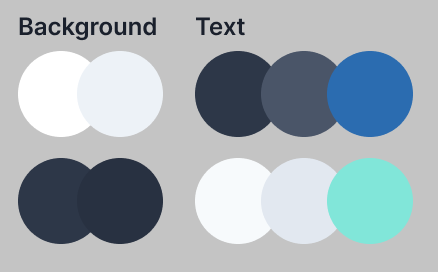

import { Callout } from "../../../src/components/atoms.js"

Dark mode is the first feature I added in my website. I really didn't know how to do it at first, especially I'm using Tailwind for my styling. I'm sure there are plugins available to use but I want to implement it myself in order to learn more about React and CSS.

Good thing I came across this beautiful article by Josh Comeau: [The Quest for the Perfect Dark Mode](https://joshwcomeau.com/gatsby/dark-mode/). Two things became clear to me: **CSS variables** and **prefers-color-scheme media query**.

In this post, I will walk you through my process on how to implement dark mode in a Gatsby and Tailwind CSS project.

<Callout>

💡 This tutorial assumes that you have a basic understanding of CSS variables and React's Context API.

🧾 This project uses Tailwind, follow their [documentation](https://tailwindcss.com/docs/installation) on how to install and setup Tailwind.

🚀 You can find the source in [GitHub](https://github.com/jeffjadulco/dark-mode-react-tailwind) and the demo [here](https://awesome-heyrovsky-f51f39.netlify.app/).

</Callout>

## Adding our CSS variables

First, let's declare all our css variables in our main css file. If you don't know which file it is, it's where you put the tailwind imports.

In my website I tried to stick with five colors: _primary_, _secondary_, and _accent_, for both background and texts. This will differ based on your design, but in my case, I already knew what colors I needed because I designed my website in Figma beforehand.



Next, add `.light` and `.dark` CSS classes and assign the colors for each variables. Then use the `@apply` directive in the root selector to apply a default theme for your page.

```css
/* index.css */

:root {
  @apply .light;
}

.dark {
  --color-bg-primary: #2d3748;
  --color-bg-secondary: #283141;
  --color-text-primary: #f7fafc;
  --color-text-secondary: #e2e8f0;
  --color-text-accent: #81e6d9;
}

.light {
  --color-bg-primary: #ffffff;
  --color-bg-secondary: #edf2f7;
  --color-text-primary: #2d3748;
  --color-text-secondary: #4a5568;
  --color-text-accent: #2b6cb0;
}

@import "tailwindcss/base";
@import "tailwindcss/components";
@import "tailwindcss/utilities";
```

## Extending Tailwind CSS

In order to use the css variables we created, we must extend the tailwind configuration.

```jsx
// tailwind.config.js

module.exports = {
  theme: {
    extend: {
      backgroundColor: {
        primary: "var(--color-bg-primary)",
        secondary: "var(--color-bg-secondary)",
      },
      textColor: {
        accent: "var(--color-text-accent)",
        primary: "var(--color-text-primary)",
        secondary: "var(--color-text-secondary)",
      },
    },
  },
}
```

<!--
<Callout>
  ☝ Remember to put them inside the `extend` object. If not, you'll be
  overriding the default Tailwind configuration
</Callout>
-->

These extensions will now be included in Tailwind classes


<Callout>

🚀 Install this [VS Code Extension](https://marketplace.visualstudio.com/items?itemName=bradlc.vscode-tailwindcss) for that sweet, sweet, Tailwind intellisense.

</Callout>

## Adding a toggle

Before we create a way for the user to toggle the theme between light or dark theme, we must first prepare our React context.

### Getting the initial theme

```jsx
// themeContext.js

const getInitialTheme = _ => {
  if (typeof window !== "undefined" && window.localStorage) {
    const storedPrefs = window.localStorage.getItem("color-theme")
    if (typeof storedPrefs === "string") {
      return storedPrefs
    }

    const userMedia = window.matchMedia("(prefers-color-scheme: dark)")
    if (userMedia.matches) {
      return "dark"
    }
  }

  // If you want to use light theme as the default, return "light" instead
  return "dark"
}
```

We are doing multiple things here: first we check if we already have a stored value in the `localStorage`. If not, we check the media query if the user browser prefers a dark or light color scheme using `prefers-color-scheme` media query.

### Creating our context

If you have no idea what a context is in React, please read their [documentation](https://reactjs.org/docs/context.html). We are using the Context API to pass our theme data without having to pass the prop down manually in every component.

Our theme context must do the following:

1. Create a state for the theme and pass the `getInitialTheme` function that we wrote earlier to get the initial state value.
2. Create another function called `rawSetTheme` that will apply the `.light` or `.dark` class in the root element and save the theme in the `localStorage`
3. Create a side effect that will call the `rawSetTheme` whenever the value of `theme` changes.

```jsx
// themeContext.js

export const ThemeContext = React.createContext()

export const ThemeProvider = ({ initialTheme, children }) => {
  const [theme, setTheme] = React.useState(getInitialTheme)

  const rawSetTheme = theme => {
    const root = window.document.documentElement
    const isDark = theme === "dark"

    root.classList.remove(isDark ? "light" : "dark")
    root.classList.add(theme)

    localStorage.setItem("color-theme", theme)
  }

  if (initialTheme) {
    rawSetTheme(initialTheme)
  }

  React.useEffect(
    _ => {
      rawSetTheme(theme)
    },
    [theme]
  )

  return (
    <ThemeContext.Provider value={{ theme, setTheme }}>
      {children}
    </ThemeContext.Provider>
  )
}
```

### Using the context provider

For our components to use the context, let's make the `ThemeProvider` as the Higher Order Component (HOC).

```jsx
// layout.js

import { ThemeProvider } from "./themeContext"

const Layout = ({ children }) => {
  return (
    <ThemeProvider>
      <Header />
      <main>{children}</main>
    </ThemeProvider>
  )
}
```

### Adding the toggle functionality

Now that we have our context ready, let's create a toggle component that will let the user switch the theme.

1. Use the `ThemeContext` to get the `theme` and `setTheme`.
2. Set the checkbox's `checked` attribute to true when the `theme` is equal to `dark`
3. Call the `setTheme` on the `onChange` event.

```jsx
// toggle.js

export const Toggle = () => {
  const { theme, setTheme } = React.useContext(ThemeContext)

  function isDark() {
    return theme === "dark"
  }

  return (
    <label>
      <input
        type="checkbox"
        checked={isDark()}
        onChange={e => setTheme(e.target.checked ? "dark" : "light")}
      ></input>
      Dark Mode
    </label>
  )
}
```

## Yay!

And there you have it! Our toggle is not as fancy as it looks, but you can do the same logic using a button or a different component.


This solution isn't perfect and there's a small caveat with this: **page load flicker**. Josh made a great write up about how he solved it in the same [article](https://joshwcomeau.com/gatsby/dark-mode/?ref=jeffjadulco.com).

## Dark mode design

I took inspirations from many other websites for the dark mode design of this website. Then, I used TailwindCSS plugin for Figma to simplify my color selection.

However, if you're interested on designing your own dark UI, check out this [in-depth article about Dark UI by Miklos Philips](https://www.toptal.com/designers/ui/dark-ui-design/?ref=jeffjadulco.com).
